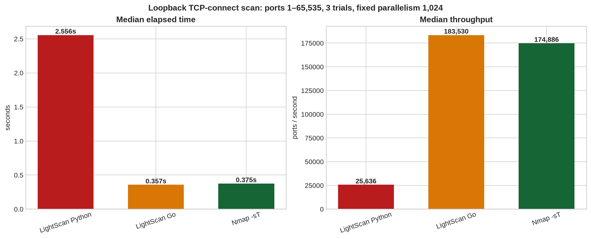

# 65,535-Port Loopback Benchmark

This benchmark compares **TCP connect scans only** against `127.0.0.1`, which is owned by the local test environment. It sends no remote-network traffic. The purpose is to isolate scanner execution overhead on a closed-loopback port range, not to generalize performance to routed, filtered, rate-limited, or production targets.

> **Scope:** `127.0.0.1`, TCP ports `1–65535`, three trials per engine, fixed parallelism of `1,024`, retries disabled, banner collection disabled, and a 1-second connect timeout.

The raw record is preserved in [`benchmark_results/loopback_65535.json`](benchmark_results/loopback_65535.json). The harness that produced it is [`tools/benchmark_loopback.py`](tools/benchmark_loopback.py).



## Results

| Engine | Trial durations (s) | Median (s) | Median throughput (ports/s) | Relative to Nmap median |
| --- | ---: | ---: | ---: | ---: |
| LightScan Python streaming engine | 2.569, 2.488, 2.556 | **2.556** | **25,636** | **6.82× slower** |
| LightScan Go companion | 0.352, 0.357, 0.406 | **0.357** | **183,530** | **0.953×** the Nmap duration; 4.7% faster in this run |
| Nmap 7.94 `-sT` | 0.391, 0.375, 0.367 | **0.375** | **174,886** | Baseline |

The compiled **Go engine** completed the loopback workload **0.018 seconds faster** than Nmap at the median, whereas the Python engine took **2.182 additional seconds**. The Go result is close enough to Nmap that the small difference should be treated as a local-environment observation rather than a universal performance claim.

## Methodology

All three tools used a TCP-connect model. Nmap was invoked with `-sT -Pn -n`, `--max-retries 0`, and fixed `--min-parallelism`/`--max-parallelism` of `1024`. LightScan Python used its streaming engine with `--concurrency 1024`, `--per-host-concurrency 1024`, `--retries 0`, `--no-adaptive`, and `--no-banner-grab`. The Go companion used the same target, port range, 1,024-way concurrency, 1-second timeout, zero retries, and disabled banner collection.

| Decision | Rationale |
| --- | --- |
| Loopback only | Prevents unapproved network activity and removes external routing and packet-loss variance. |
| TCP connect only | Nmap describes `-sT` as its high-level operating-system `connect`-call scan; LightScan’s benchmarked modes use the same class of TCP connection attempt.[1] |
| Fixed high parallelism | Places all engines under the same aggressive closed-loopback workload. Nmap itself warns that this high setting can harm reliability outside such a controlled test. |
| Retries disabled | Measures best-effort throughput rather than retransmission policy. It must not be used to infer accuracy on lossy networks. |
| Three trials and medians | Reduces sensitivity to a single scheduler or cache outlier, while remaining quick and reproducible. |

## Interpretation

The Python result identifies the next performance frontier: process startup, Python asyncio scheduling, result-object handling, and high-level `asyncio.open_connection` overhead dominate an ultra-fast closed-loopback scan. The v2.2 streaming architecture prevents unbounded task allocation and preserves explicit rate, retry, host, and feedback controls; it is a reliability and maintainability foundation rather than a replacement for a compiled socket engine.

The Go companion validates the dual-engine strategy. On this specific loopback workload it reaches the same performance class as Nmap’s connect scan and slightly exceeds the median throughput. That does **not** show that LightScan surpasses Nmap on real networks: Nmap has mature adaptive timing, raw-packet modes, protocol coverage, and decades of edge-case handling. Its documentation also cautions that aggressive timing and rate settings can trade correctness for speed.[2] [3]

For production authorized assessments, retain retries, use conservative rate/host controls, run multiple representative target classes, and compare equivalent scan modes. The benchmark harness intentionally refuses arbitrary targets; edit neither the target constant nor the scope without a documented authorization and a revised methodology.

## Reproduction

```bash
sudo apt-get install nmap lua5.4
make go
python3 tools/benchmark_loopback.py \
  --trials 3 --concurrency 1024 --timeout 1.0 \
  --output benchmark_results/loopback_65535.json
```

## References

[1]: https://nmap.org/book/scan-methods-connect-scan.html "Nmap TCP Connect Scan"
[2]: https://nmap.org/book/man-performance.html "Nmap Timing and Performance"
[3]: https://nmap.org/book/port-scanning-algorithms.html "Nmap Scan Code and Algorithms"
