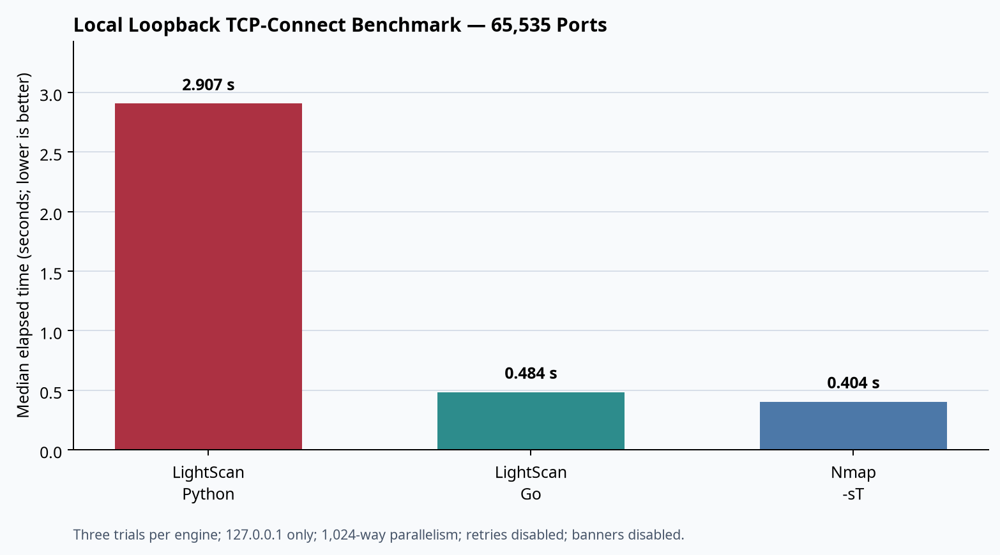

# LightScan v2.6.0 and Nmap: Local Benchmark and Feature Comparison

## Executive summary

This report compares **equivalent TCP-connect discovery** on `127.0.0.1` across ports `1-65535`. It is a controlled local loopback measurement, not a claim that either tool is faster or more complete across real networks, scan modes, operating systems, UDP, raw-packet work, service detection, OS detection, or scripting.

In this run, **Nmap 7.94SVN `-sT`** completed the narrow workload with a median of **0.404 s**. The LightScan Go companion completed it in **0.484 s**—**1.199×** Nmap’s median time, or **80.1%** of Nmap’s median throughput. The LightScan Python streaming engine completed it in **2.907 s**—**7.204×** Nmap’s median time. These results identify the Go scheduling/connection path as the relevant performance target for TCP-connect parity; they do not support a claim that LightScan surpasses Nmap generally.



## Scope and controls

| Item | Value |
| --- | --- |
| Target | `127.0.0.1` only |
| Port range | `1-65535` |
| Scan type | TCP connect |
| Remote network traffic | None |
| Trials | 3 per engine |
| Fixed parallelism | 1,024 |
| Timeout | 1.0 second for LightScan; Nmap host timeout set to 60 seconds |
| Retries | Disabled for all engines |
| Banner collection | Disabled for LightScan |
| Adaptive timing | Disabled for the Python run |
| Nmap version | `7.94SVN` |
| Result source | [`benchmark_results/loopback_65535_v26.json`](benchmark_results/loopback_65535_v26.json) |

The repository harness rejects arbitrary targets and is intended to measure scheduler and process overhead on the same closed loopback port range. It does not benchmark packet loss, route distance, firewalls, IDS behavior, host discovery, UDP, SYN scanning, OS fingerprinting, service-probe coverage, or script execution.

> **Important warning.** Nmap printed warnings that `--min-parallelism 1024` and `--max-parallelism 1024` can hurt reliability. These deliberately aggressive settings were used only to apply equivalent high-parallelism pressure on local loopback. They are not a recommended production configuration.

## Measured results

| Engine | Trial 1 (s) | Trial 2 (s) | Trial 3 (s) | Median (s) | Median ports/s | Relative to Nmap median time |
| --- | ---: | ---: | ---: | ---: | ---: | ---: |
| LightScan Python | 2.907 | 2.851 | 2.932 | **2.907** | 22,543.991 | 7.204× slower |
| LightScan Go | 0.488 | 0.457 | 0.484 | **0.484** | 135,445.429 | 1.199× slower |
| Nmap `-sT` | 0.404 | 0.413 | 0.387 | **0.404** | 162,401.867 | Baseline |

The Go companion was **0.080 s** behind Nmap at the median under these controls. The Python engine was **2.503 s** behind Nmap at the median, with its additional event-loop and normalized result-model overhead visible in the loopback result.

## Commands under test

The exact commands are retained in the JSON artifact. Their functional forms were:

```bash
# LightScan Python streaming TCP-connect engine
python -m lightscan --no-banner --scan -t 127.0.0.1 -p 1-65535 \
  --concurrency 1024 --per-host-concurrency 1024 --timeout 1.0 \
  --retries 0 --no-adaptive --no-banner-grab --no-report

# LightScan Go TCP-connect engine
./scanner/lscan -t 127.0.0.1 -p 1-65535 -c 1024 \
  --per-host-concurrency 1024 -T 1000 --retries 0 \
  --no-banner --open --json --summary

# Nmap TCP-connect baseline
nmap -sT -Pn -n --max-retries 0 --min-parallelism 1024 \
  --max-parallelism 1024 --host-timeout 60s -p 1-65535 127.0.0.1
```

## Feature comparison

Nmap is the more mature general-purpose scanner. Its documented scope includes numerous scan techniques, detailed OS detection using a database of more than 2,600 fingerprints, service/version detection using thousands of match expressions, and a broad Lua scripting ecosystem.[1] [2] [3] The table below distinguishes those capabilities from LightScan’s current authorized-inventory emphasis.

| Area | LightScan v2.6.0 | Standard Nmap | Assessment |
| --- | --- | --- | --- |
| TCP-connect discovery | Bounded Python scheduler plus optional Go engine, rate caps, per-host caps, retry jitter, telemetry, NDJSON. | Mature `-sT` implementation with established timing engine. | Nmap led the measured loopback case; LightScan Go is in the same order of magnitude. |
| Resource observability | Exports attempts/outcomes, retry delay, runtime file-descriptor limits/counts where available, maximum RSS, and portable snapshots. | Rich runtime interaction and timing controls are documented; this benchmark did not compare telemetry schemas. | LightScan’s portable local metrics are an inventory-automation strength, not a throughput substitute. |
| Target guardrails | Explicit expanded-target ceiling and retained source-independent planning. | Broad target-expression support and host discovery capabilities. | LightScan emphasizes pre-scan bounds; Nmap has broader target and discovery maturity. |
| Service observation | Protocol-aware probes for common services, executed after discovery on confirmed open ports. | `-sV` uses `nmap-service-probes`, with about 6,500 pattern matches for more than 650 protocols documented by Nmap.[3] | Nmap has much broader fingerprint coverage; LightScan favors a smaller, inspectable common-service path. |
| OS context | Passive service-evidence inference and offline import of Nmap OS observations; active OS paths remain separate. | Active TCP/IP stack fingerprinting and `nmap-os-db` matching across more than 2,600 fingerprints.[2] | Nmap is materially broader. LightScan intentionally does not copy Nmap’s database. |
| Scripting | Constrained Lua 5.4 checks with reviewed safe categories and a read-only observation context. | Full NSE ecosystem with broad categories; Nmap warns scripts are not sandboxed.[4] | LightScan is safer by design for reviewed inventory checks; Nmap is substantially more extensible. |
| Nmap evidence interoperability | Imports local Nmap XML OS matches, CPEs, and open-service observations without executing Nmap. | Emits Nmap XML natively. | LightScan can normalize existing Nmap evidence into its reporting workflow. |
| Structured output | JSON, HTML, CSV, minimal text, Nmap-style XML, NDJSON, and portable performance snapshots. | Normal, XML, grepable/XML-adjacent output formats and script output. | Both support automation; schema choices differ. |
| Scan-mode breadth | TCP connect is the measured and maintained high-scale path; optional specialized modules exist. | Broad, mature scan-method catalogue including raw-packet techniques, UDP, IP protocol scans, and more.[1] | Nmap remains the more capable general-purpose scanner. |

## Interpretation and next targets

The primary performance conclusion is narrow and actionable: on this host and this fully local TCP-connect workload, the Go engine is the path closest to Nmap, while the Python path remains materially slower. Next work should therefore focus on profiling Go connection scheduling and result-drain overhead under controlled loopback conditions, then repeat the comparison at multiple safe concurrency levels and with a fixed local listener set.

Performance work must continue to preserve the strengths of LightScan’s inventory model: bounded planning, explicit rate and per-host limits, retry/outcome telemetry, structured output, local-only regression coverage, and a clear authorization boundary. In real environments, equivalent scan completeness matters as much as elapsed time. Nmap’s timing documentation likewise emphasizes the interaction of parallelism, timeouts, retransmissions, and host grouping with accuracy.[5]

## Reproduction

```bash
make go
python tools/benchmark_loopback.py --trials 3 --concurrency 1024 --timeout 1.0 \
  --output benchmark_results/loopback_65535_v26.json
```

Use the committed JSON artifact and this report together. Do not compare this result with scans that change the target range, port range, scan type, retry policy, rate limits, banner behavior, service detection, operating-system load, or Nmap timing controls.

## References

[1]: https://nmap.org/book/man.html "Nmap Reference Guide"
[2]: https://nmap.org/book/man-os-detection.html "Nmap OS Detection"
[3]: https://nmap.org/book/man-version-detection.html "Nmap Service and Version Detection"
[4]: https://nmap.org/book/man-nse.html "Nmap Scripting Engine"
[5]: https://nmap.org/book/man-performance.html "Nmap Timing and Performance"
